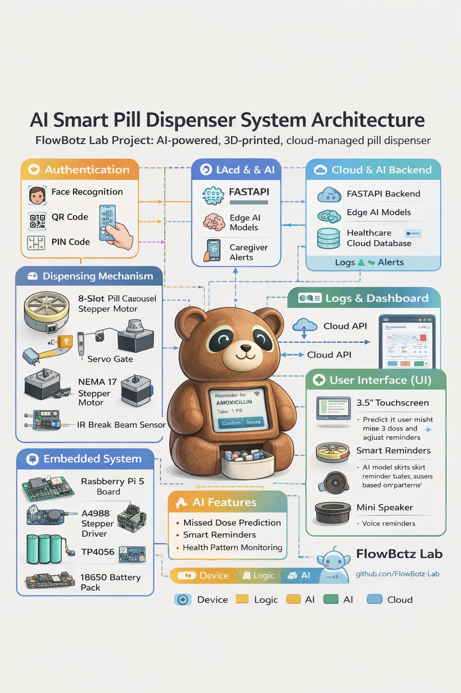

# AI Smart Pill Dispenser (Cloud-Managed IoT System) 🧸💊

FlowBotz Lab Project  
AI-powered, 3D-printed, cloud-managed medication dispenser designed for safety, reliability, and intelligent reminders.

---

# Project Overview

The **AI Smart Pill Dispenser** is a secure, child-proof medication system designed to:

- Remind users when it is time to take medication
- Dispense medication only during scheduled time windows
- Authenticate the authorized user before dispensing
- Log all medication activity (Taken / Missed / Late)
- Upload logs securely to a cloud database
- Use AI to predict missed doses and improve reminders

This project demonstrates the integration of:

- Embedded Systems
- Robotics
- Artificial Intelligence
- Cloud Infrastructure
- IoT Device Engineering

---

# System Architecture

The system consists of several interacting components:

### Authentication
Users must authenticate before medication is dispensed.

Options include:

- Face Recognition
- QR Code Authentication
- PIN Code

---

### Dispensing Mechanism

The dispenser uses a **rotating pill carousel** controlled by a **stepper motor**.

Sequence:

1. AI reminder triggers medication time
2. User authenticates
3. Carousel rotates to the correct compartment
4. Servo gate opens
5. Pills drop through the chute
6. IR sensor confirms successful dispense

Components:

- 8-slot pill carousel
- NEMA 17 stepper motor
- MG90S servo gate
- IR break beam sensor
- Hall effect sensor (position detection)

---

### Embedded System

The device is powered by:

- Raspberry Pi 5
- A4988 Stepper Driver
- 18650 Battery Pack
- TP4056 Charging Module

The Raspberry Pi handles:

- Motor control
- Sensor monitoring
- Touchscreen UI
- Cloud communication
- AI inference

---

### User Interface

Users interact with the system using a **touchscreen on the bear’s chest**.

Features:

- Medication reminder screen
- Confirm / Snooze buttons
- Status alerts
- Smart reminder adjustments

Audio reminders are delivered through a **mini speaker inside the bear head**.

---

### Cloud & AI Backend

The system connects to a cloud backend for:

- Medication logs
- Remote caregiver alerts
- AI prediction models

Technologies used:

- FastAPI backend
- Cloud database
- Edge AI models running on device

---

# Hardware Components

### Core System

- Raspberry Pi 5
- 3.5" Touchscreen Display
- NeoPixel LED Ring
- Camera Module
- Mini Speaker

---

### Dispensing Hardware

- NEMA 17 Stepper Motor
- A4988 Stepper Driver
- MG90S Servo Motor
- IR Break Beam Sensor
- Hall Effect Sensor

---

### Power System

- 18650 Lithium Batteries
- TP4056 Charging Module
- 5V Buck Converter

---

### Mechanical Components

- 3D Printed Bear Shell
- Pill Carousel
- Selector Plate
- Servo Dispensing Gate
- Pill Delivery Chute
- Removable Pill Cup

All structural components are designed for **3D printing**.

---

# Bear-Shaped Enclosure Design 🧸

The device is designed as a friendly **bear-shaped robot** to make medication reminders more approachable.

### Bear Head

Contains:

- Camera
- LED status lights
- Speaker

---

### Bear Chest

Contains:

- Touchscreen display
- User interface

---

### Bear Belly

Contains:

- Pill dispensing mechanism
- Carousel system
- Servo gate
- Sensors

---

### Rear Panel

Removable access panel for:

- Raspberry Pi
- Battery
- Wiring

---

# Repository Structure

ai-smart-pill-dispenser
│
├── docs
│ ├── diagrams
│ │ └── system_architecture.png
│ └── blueprints
│
├── ai
├── cloud
├── firmware
├── hardware
├── ui
│
├── README.md
├── LICENSE
└── .gitignore

---

# Development Roadmap

### Phase 1 — Mechanical Prototype
- Design carousel system
- 3D print components
- Test motor control

### Phase 2 — Embedded Control
- Stepper motor indexing
- Servo gate operation
- Sensor integration

### Phase 3 — User Interface
- Touchscreen UI
- Reminder alerts
- Confirm / Snooze functionality

### Phase 4 — Cloud Integration
- Log upload
- Caregiver notifications
- Dashboard

### Phase 5 — AI Integration
- Missed dose prediction
- Smart reminder optimization

---

# Safety Disclaimer

This project is a **student engineering prototype** and is not intended to replace professional medical devices.

Always follow medication instructions from a licensed healthcare provider.

---

# License

MIT License

